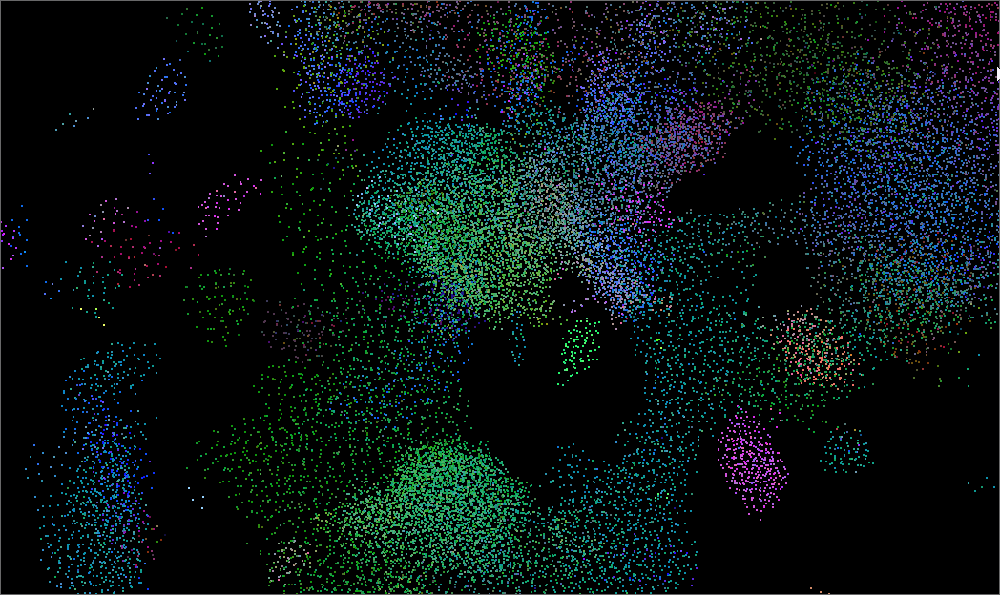

**University of Pennsylvania, CIS 5650: GPU Programming and Architecture,
Project 1 - Flocking**

* Saahil Gupta
  * [LinkedIn](www.linkedin.com/in/saahil-g), [personal website](www.saahil-gupta.com)
* Tested on: Windows 11 10.0.26100, AMD Ryzen 9 7940HS @ 4.0GHz 32GB, RTX 4060 Laptop GPU 8GB

### Boids

### Performance Analysis

1. For the naive method, increasing the number of boids saw a close to exponential decrease in performance. This is likely due to the nature of the algorithm, which had every boid checking with every other boid, creating an $n^2$ number of calculations done, which even when parallelized, would create a sharp falloff when significantly increasing the number of boids. For both grid methods, increasing the number of boids saw a much shallower decrease in performance, which is likely also due to the nature of that algorithm, in which an increase to the total amount of boids would only fractionally increase the amount of checks.
2. Changing the block size for all three methods seemed to have a negligible effect on performance. This is likely because there is little to no coherency between the threads, which would mean that changing block size would have little to no effect. The only difference that was noticed was a decent increase in performance for the coherent grid method, likely because it is cache-friendly, which benefits from an increased block size.
3. The coherent uniform grid saw about a 25%-35% increase in overall frametimes compared to the non-coherent grid method. This was expected, as the coherent grid is more cache friendly with its memory layout. 
4. Checking 27 vs 8 neighboring cells did not seem to result in much of a performance change. This is likely because my implementation results in a good amount of divergence, resulting in the conditionals for each being sequentially processed. This would explain the lack of improvement despite checking less cells, although it implies there exists some room for improvement here.